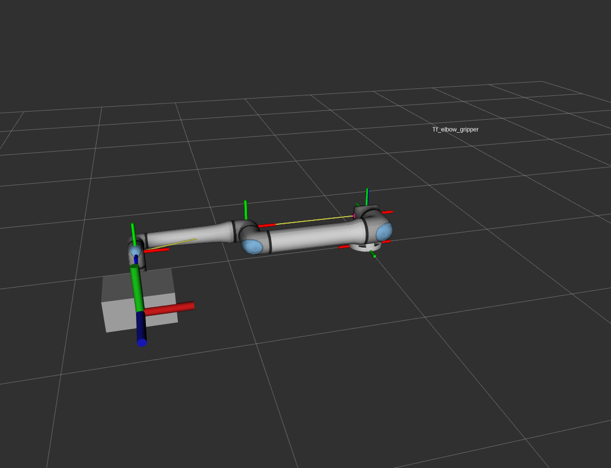

# 🦾 Robotics Software Engineer Technical Assessment

This guide explains how to build and run the **PR_assessment** Docker workspace for the technical tasks, after you clone it in an empty folder.

---

📁 1. Move to the Root Directory
```bash
cd PR_assessment/
```

📁 2. Allow X11 Access for Docker (for GUI Apps like RViz)

```bash
xhost +local:docker
```

🐳 3. Build and Run the Docker Environment
```bash
docker-compose build
docker-compose up -d
```


🔧 4. Access the Container

```bash
docker-compose exec ros_humble bash
```


📦 5. Add the UR Description Dependency
```bash
cd src/
git clone https://github.com/UniversalRobots/Universal_Robots_ROS2_Description.git
cd ..
```

🏗️ 6. Build the Workspace
```bash
colcon build
```

🌱 7. Source the Workspace
⚠️ You must run this in every terminal you open inside the container.

```bash
source install/setup.bash
```


🤝 8. Run Task 2 (in Two Terminals)

Terminal 1:
run the server

```bash
ros2 run linear_algebra_nodes serverOOP
```


Terminal 2: 

exec the container

```bash
cd PR_assessment/
docker-compose exec ros_humble bash
```
and run the client
```bash
source install/setup.bash
ros2 run linear_algebra_nodes clientOOP
```

🤝 8. Stop Task 2 (in both Terminals)

Stop the nodes from running with Ctr+C


🚀 9. Run Task 3
```bash
ros2 launch ur20_display ur20.launch.py
```

🧹 10. Clean Up
```bash
docker-compose down
xhost -local:docker  # (Optional: revert X11 permissions)
```
